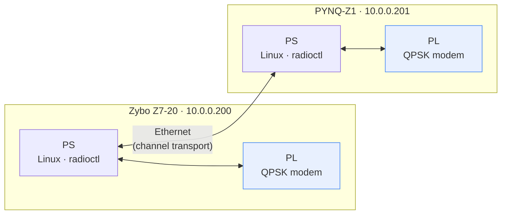
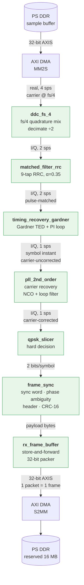
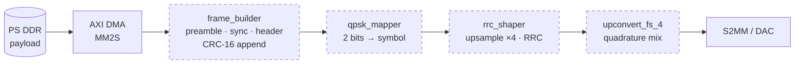
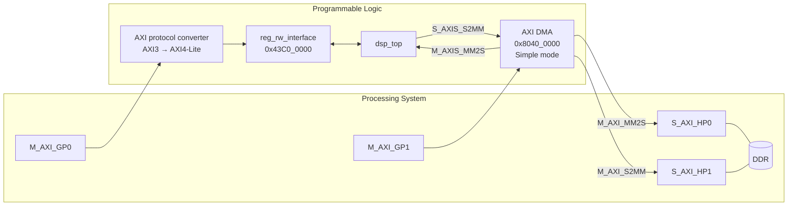
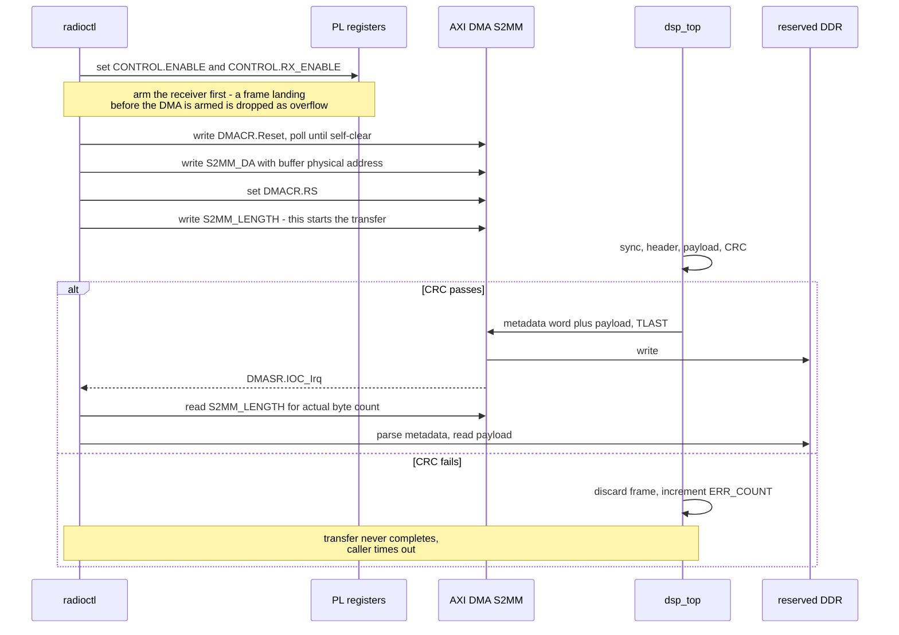

# Comms DSP — System Design

A QPSK radio implemented in FPGA fabric on two Zynq-7000 boards (Zybo Z7-20 and
PYNQ-Z1), with the modem in the PL and control, framing policy, and transport in
the PS. Both boards run the same bitstream; role is selected at runtime.

This document describes **architecture and interfaces**. For build procedure,
boot flow, and the running log of problems and fixes, see
[zybo_work.md](zybo_work.md).

**Status legend used throughout:** ✅ built · 🟡 built but unsimulated · ⬜ not started

---

## 1. System context



There is no RF front end. The "channel" is Ethernet between the two PS
instances: one board's PS pushes a sample stream into its PL via DMA, the PL
demodulates, and the recovered frame comes back through DMA. Impairments
(noise, frequency offset, timing offset) are injected deliberately so the
recovery loops have something to do.

That makes this a **DSP exercise wearing a radio's clothing** — which is the
point. The loops are real; only the propagation is simulated.

---

## 2. RX chain

### 2.1 Signal path



Green = simulated. `tb_dsp.vhd` runs the full chain end to end (DDC through
DMA S2MM) against a framed, impaired burst and now passes: 4/4 frames CRC-clean,
4/4 sync detections, quality ratio 719/1000 (1000 = ideal, <700 = poor lock).

**PLL moved to run AFTER Gardner, not right after the DDC.** Two things
changed from the original design, in this order:

1. Matched filter moved ahead of the PLL (`ddc → filter → pll → gardner`).
   `pll_2nd_order`'s decision-directed detector is far noisier against raw,
   not-yet-matched-filtered samples (every other 2 sps sample is a mid-symbol
   transition point, not a peak) than against the filtered signal Gardner was
   already getting. Measurable but modest (~13% tighter steady-state jitter).
2. Gardner moved ahead of the PLL entirely (`ddc → filter → gardner → pll`).
   The real fix for the noise in (1): even matched-filtered 2 sps samples are
   still half off-peak. Gardner's TED is close to carrier-phase independent
   by design (that's why it can bootstrap before anything is demodulated), so
   it's safe to run it first and hand the PLL Gardner's recovered, always-
   on-peak 1 sps symbols instead. `test_bench/loop_model.py`'s
   `run_pll_pure_tone()` - the PLL against a single unmodulated tone, no data,
   no Gardner - is what actually separates "loop mechanism" problems from
   "data content" problems; it's how (1) was shown to be real but insufficient,
   and how a THIRD, unrelated bug (next paragraph) was then found underneath it.

**The PLL had a sign error, not a bandwidth problem.** `pd_proc` rotates the
input FORWARD by `theta_nco` (`psi = phi_in + theta_nco`), not the standard
DEROTATION (`psi = phi_in - theta_nco`) closed-form PLL design formulas
assume. That sign difference means the detector's measured gain has to be
NEGATED before deriving `K1`/`K2` - missed once, it produces a K1/K2 pair
that passes every dead-zone/margin check (they don't check sign) while the
real closed loop has positive, not negative, feedback. `run_pll_pure_tone()`
caught it: wrong sign oscillates continuously across virtually the entire
detector's range regardless of loop bandwidth, damping factor, or step-size
clamping (none of those fix a sign error); negating both `K1` and `K2`
collapsed that to a clean, textbook damped step response. See
`pll_2nd_order.vhd`'s `K1`/`K2` comment and `loop_model.py`'s
`characterize_pll_detector()` for the full derivation - the fix is applied at
the source (the measured Kd is negated before any gain is derived from it),
so a straight regenerate keeps the right sign automatically.

**`dsp_top` runs on its own clock domain now, `dsp_clk` (FCLK1, 1 MHz),
decoupled from the AXI/DMA side's `clk` (FCLK0, 40 MHz) by two async CDC
FIFOs.** Before this, `data_valid` was wired straight to `mm2s_tvalid`: the
DSP chain advanced one sample per AXI-Stream beat, so the "sample rate" was
really however fast DMA happened to deliver bytes, not a chosen number, and
`mm2s_tready` was hardwired `'1'` (no backpressure at all). `dsp_clk` at
1 MHz matches every constant already designed against `fs = 1 MHz`
elsewhere (RRC taps, `ddc_fs_4`'s fs/4 carrier placement, both
`loop_model.py`-designed loop filters) - `dsp_top` now runs at a real,
chosen sample rate instead of inheriting AXI/DMA throughput, and
`mm2s_tready` genuinely reflects FIFO occupancy.

- **New file**: `axis_cdc_fifo.vhd` - a generic `xpm_fifo_async` wrapper
  (first-word-fall-through), one instance per direction (MM2S → `ADC_IN`,
  `rx_t*` → S2MM). `reg_rw_interface` and `sample_sniffer` stay on `clk`;
  the sniffer's tap inputs cross via a plain 2-flop strobe synchronizer
  (`tap_sync_proc` in `system_top.vhd`) rather than another FIFO - they are
  diagnostic-only signals from a much slower source domain sampled by a
  much faster destination domain, so losing a synchronizer stage's worth of
  precision on an occasional diagnostic sample doesn't matter the way it
  would for the sample path itself.
- **Bring-up gotcha**: `PCW_FPGA1_PERIPHERAL_FREQMHZ` alone sets FCLK1's
  requested rate but does not bring the output out - `PCW_EN_CLK1_PORT` and
  `PCW_FPGA_FCLK1_ENABLE` both default to enabled once a frequency is set,
  but `PCW_FCLK_CLK1_BUF` does not; leaving it `FALSE` means `dsp_clk` never
  toggles, and `dsp_top` never advances past its first sample - a simulation
  that looks hung, not obviously a clocking bug. `create_project.tcl` now
  sets `PCW_FCLK_CLK1_BUF {TRUE}` explicitly.
- **First hand-authored timing constraint this project has needed**:
  `vivado/constraints/system_top_cdc.xdc` declares `clk`/`dsp_clk` an
  asynchronous clock group (`set_clock_groups -asynchronous`). Until
  `dsp_clk` existed, Vivado's automatic clock derivation from the PS7 BD
  cell was sufficient for a single-clock design; two genuinely independent
  clocks need this declared explicitly, or the static timing analyzer
  applies a normal synchronous setup/hold check across a boundary that by
  design has no fixed phase relationship, and reports it failing - not a
  real violation, a missing constraint. `xpm_fifo_async` handles the
  *functional* metastability correctly on its own (`CDC_SYNC_STAGES`), but
  per Xilinx's own guidance that does not exempt the design from also
  declaring the clock group - same for the hand-written `tap_sync_proc`
  synchronizer, which has no XPM macro to do it automatically. Checked in
  as a real file (not generated only at project-creation time) so a project
  maintained by hand between `create_project.tcl` regenerations can still
  pull it in directly.
- **Verified**: with the buffer-enable and clock-group fixes above,
  implementation closes timing on both domains and `dsp_top` recovers
  frames correctly running on its own dedicated `dsp_clk`.

### 2.2 Stage reference

| Stage | File | In → Out | Status |
|---|---|---|---|
| Downconversion | `ddc_fs_4.vhd` | real 4 sps → I/Q 2 sps | ✅ |
| Matched filter | `matched_filter_rrc.vhd` | I/Q 2 sps → I/Q 2 sps | ✅ |
| Timing recovery | `timing_recovery_gardner.vhd` | I/Q 2 sps → I/Q 1 sps | ✅ |
| Carrier recovery | `pll_2nd_order.vhd` | I/Q 1 sps → I/Q 1 sps | ✅ |
| Hard decision | `qpsk_slicer.vhd` | 1 symbol → 2 bits | ✅ |
| Framing | `frame_sync.vhd` | bits → bytes + verdict | ✅ |
| Buffering | `rx_frame_buffer.vhd` | bytes → 32-bit packet | ✅ |

All sample-path signals are **16-bit signed**. The chain is **sample-rate
agnostic**: it advances one sample per `data_valid` strobe regardless of the
fabric clock, so no clock-domain conversion is needed anywhere — only the right
strobe. `G_VALID_SRC` selects where that strobe comes from (`VALID_DMA`,
`VALID_ADC`, or `VALID_ALWAYS` for simulation).

That sample-rate-agnostic property is also why FCLK0 (`clk`, the AXI/DMA
side) is a free parameter rather than a system requirement: it is **40
MHz**, chosen to close timing on the matched filter's DSP cascade, and no
part of the chain's *functional* behaviour depends on it - dsp_top's own
RTL has no notion of wall-clock time anywhere, only discrete
`data_valid`-driven samples (see §2.1's clock-domain note, and the same
point applies to `test_dsp_top.vhd`'s own testbench clock, which is
similarly free to pick for simulation-time readability without changing
what's being tested).

**`dsp_clk` (FCLK1, `dsp_top`'s own domain, §2.1) is different: 1 MHz is not
an arbitrary choice there.** It is not a timing requirement either - the
loop filters would still be functionally correct at any rate the CDC FIFOs
could keep up with - but it is what makes the *design-time* `Bn·Ts`
assumption behind the PLL/Gardner gains (`loop_model.py`) and the
stimulus's `freq_err_hz`/`ppm` (in real Hz, computed against `FS =
1_000_000` in `waveform_generator.py`) both describe the same real-world
signal. Changing it would not break the RTL, but it would silently change
what frequency offset "250 Hz residual" and what clock error "20 ppm"
actually represent relative to the sample rate, without anything failing
loudly to say so.

Both clocks are set in two places that must agree — `PCW_FPGA0_
PERIPHERAL_FREQMHZ`/`PCW_FPGA1_PERIPHERAL_FREQMHZ` in `create_project.tcl`
(the timing constraints) and `assigned-clock-rates` in the devicetree (the
actual rates) - see §2.1's bring-up gotcha for FCLK1 specifically
(`PCW_FCLK_CLK1_BUF`), which has no FCLK0 equivalent since FCLK0 already
worked before `dsp_clk` was added.

### 2.3 Design decisions worth knowing

**Two independent recovery loops, both mandatory.** The carrier loop fixes
*what* the samples are; the timing loop fixes *when* they are taken. A perfect
carrier lock sampled at the wrong instant still yields no bits. They are
separate feedback systems and neither substitutes for the other.

**Coarse/fine split of carrier recovery.** `ddc_fs_4` removes the bulk carrier
using nothing but sign flips (`{+x,0,-x,0}` / `{0,+x,0,-x}`), leaving
`pll_2nd_order` to track a small residual offset — which is what a 2nd-order
loop is good at. Asking the PLL to acquire from DC all the way to fs/4 is the
fragile case, and an earlier version that did exactly that (DDC and PLL as
*alternative* branches rather than in series) fed the matched filter a signal
still at the carrier. The PLL itself has since moved twice more (matched
filter, then Gardner, ahead of it) — see §2.1's note — but this coarse/fine
split between the DDC and the PLL is unchanged; only what feeds the PLL
between them moved.

**2 sps is a Gardner requirement, not an arbitrary choice.** Gardner's timing
error detector needs exactly two samples per symbol, which is why `ddc_fs_4`
decimates by 2 rather than 4. It was chosen over Mueller & Müller because it is
**decision-free** — it needs no symbol decisions, so it can bootstrap before
anything is demodulated, avoiding the chicken-and-egg problem during
acquisition.

**Timing is currently quantised to whole input samples.** The loop takes
whichever sample its phase accumulator lands on, so the sampling instant moves
in half-symbol steps and residual error never drops below ±¼ symbol. This is a
bring-up compromise, not a final answer — but `mu` (the fractional symbol phase)
is exactly what a Farrow interpolator consumes, so the upgrade is additive: the
detector and loop filter don't change. Farrow + polyphase resampling is
deliberately deferred to a standalone project.

**Hard decision is free.** For Gray-mapped QPSK the nearest constellation point
is determined entirely by quadrant, so the hard decision *is* the two sign bits
— no comparators, no thresholds. The cost is about 2 dB versus soft decision,
which only pays off once there's an FEC decoder to consume the soft values.

**Phase ambiguity is resolved at the sync word.** A Costas/2nd-order carrier
loop locks to an arbitrary multiple of 90°, because a QPSK constellation is
symmetric under 90° rotation — nothing in a single symbol can resolve it.
`frame_sync` compares against all four rotations of the sync word
simultaneously; whichever matches names the rotation, and every subsequent
symbol is derotated by its inverse. The alternative, differential encoding,
resolves it without a sync word but roughly doubles the bit error rate, and a
sync word is in the frame anyway.

**Store-and-forward, not cut-through.** `rx_frame_buffer` holds the frame until
the CRC verdict arrives and releases it only if it passed. Streaming bytes to
DDR as they arrive would need no buffer — but the CRC arrives *after* the
payload, so userspace would find bytes in its buffer with no way to know if they
were good until a status register told it separately. Every reader would have to
implement that handshake correctly. Storing first means **a completed DMA
transfer is by construction a valid frame**. The cost is 256 bytes of RAM and a
frame ceiling the format already imposes.

**Downconversion sign is load-bearing.** `ddc_fs_4` multiplies by
`exp(-jωn) = cos - j·sin`, so the Q branch **negates** the sin term. Using
`+sin` yields the conjugate baseband — a *reflected* constellation — and a
reflection is not one of the four rotations `frame_sync` searches, so sync can
never fire. This hid well: a conjugated QPSK signal is still valid QPSK, the
constellation looks clean, the matched filter behaves, and the carrier loop
still locks. It only fails at the framer.

### 2.4 Verification model

`test_bench/rx_model.py` is a floating-point reference receiver that decodes
`ddc_input.dat` and checks it against `rx_expected.txt`.

It deliberately **does not model the PLL or the Gardner loop** — it applies the
known frequency and timing offsets directly. That separates two questions that
are miserable to debug together: *is the frame format self-consistent?* (this
model) versus *do the loops converge?* (RTL simulation). It also sweeps all four
carrier lock angles, because a clean run otherwise leaves the phase-ambiguity
path entirely untested.

Both bugs above were found by this model before any RTL simulation ran.

**`test_bench/loop_model.py`** is the companion model for the two loops
`rx_model.py` deliberately skips — a bit-exact (fixed-point-accurate)
Python model of `pll_2nd_order.vhd`'s and `timing_recovery_gardner.vhd`'s
loop filters and detectors, built the same way `waveform_generator.py`
designs the RRC taps: design in float from closed-form theory, quantize to
the real fixed-point format, verify numerically, THEN emit VHDL constants.
Run `python3 loop_model.py` for the full design/verification report, or
`-plot`/`--plot` to additionally open live, zoomable traces of `phase_err`,
`u`, `timing_err`, `mu`, and I/Q at each stage — useful for comparing
sample-by-sample against a real RTL simulation waveform viewer. It's what
found the PLL sign error (§2.1) and the Gardner self-noise pathology
(§4.4): both were caught by `run_pll_pure_tone()`/`run_gardner_alternating()`
isolating "loop mechanism" from "data content" problems, not by inspection.

### 2.5 Known gaps

- **Resolved, was here as an open item:** the full chain (DDC through DMA
  S2MM) is now simulated end to end by `tb_dsp.vhd` against a framed,
  impaired burst - 4/4 frames CRC-clean, quality ratio 719/1000. Getting
  there needed three separate fixes: a genuinely broken carrier phase
  detector formula, a sign error in the PLL's loop-filter gains (see §2.1),
  and a preamble bit pattern (`0xCCCCCCCC`) that turned out to trigger a
  Gardner TED self-noise pathology - see §4.4. `test_bench/loop_model.py`
  is the tool that found the last two; `test_bench/rx_model.py` still
  covers the framing/CRC path independently (§2.4).
- **Resolved, was here as an open item: hardware now reproduces the sim
  result** (`radioctl loopback`, whole file: 4/4 frames CRC-clean, quality
  720/1000 vs. sim's 719/1000). The DSP chain was never actually the
  problem on hardware - every hardware-only symptom (poor lock, 0/4 frames,
  `S2MM_DMASR` stuck at `0x00000000`) traced to one root cause: `axi_dma_0`'s
  `c_sg_length_width` left at its IP default of 14 bits (max 16383 bytes).
  A whole-file transfer (6140 samples × 4 bytes = 24560 bytes) overflows
  that silently rather than erroring - `24560 mod 16384 = 8176 bytes =
  2044 samples`, confirmed directly via a hardware ILA capture showing
  `dsp_valid` as a clean, gap-free burst of exactly 2044 samples then
  nothing for the rest of the capture. Fixed via `CONFIG.c_sg_length_width
  {23}` on `axi_dma_0` (`create_project.tcl`). See `docs/zybo_work.md`'s
  "WHERE THINGS STAND" §-1 for the full account, including the
  `sample_sniffer.vhd`/reset/`PCW_FCLK_CLK1_BUF` fixes found along the way
  that were real but not this bug.
- Gardner's timing resolution is still whole-sample-quantised (see the
  bullet below) - correctly converged, not correctly precise. `G_K = 12578`
  / `G_GAIN_FRAC = 16` are the loop_model.py-designed values, not untuned
  placeholders, but the underlying whole-sample quantisation (mu -> Farrow
  interpolator upgrade) is still open.
- `pll_2nd_order` exports no `valid_out`; `dsp_top` compensates with a
  one-cycle delay that breaks silently if the PLL's pipelining changes.
- No lock detector, so `STATUS.PLL_LOCKED` reads 0 permanently.
- No AGC. `qpsk_slicer.mag_out` exists as a hook for one.
- False sync probability is ~2⁻³⁰ per symbol (32-bit word × 4 rotations). The
  CRC catches it, so it costs an `ERR_COUNT` increment, not corrupt data.
- Single frame buffer: a frame arriving while the previous is still draining is
  dropped and flagged in `STATUS.OVERFLOW`.

---

## 3. TX chain ⬜

**Not started.** No modulator, pulse shaper, or upconverter exists. `TX_LEN`,
`CONTROL.TX_START` and `STATUS.TX_BUSY` are wired through the register block and
work end to end, but drive nothing.

Reserved for it:



Two structural notes for when this gets built:

- The **RRC taps must come from the same definition as the RX filter**, at the
  transmit rate (4 sps, so 17 taps for a 4-symbol span). A matched filter is
  only "matched" if both ends derive from one pulse-shape definition — an
  earlier mismatch (69 TX taps against a 17-tap placeholder triangle) is exactly
  how this goes wrong. `waveform_generator.py::write_vhdl_coeffs(rx_sps=…)`
  already emits both rates from one source.
- **Role is runtime-selected, not build-time.** `MODE.ROLE` picks TX or RX from
  one bitstream, so both chains are always present in fabric and either board
  can be either end.

---

## 4. PL ↔ PS interface control

### 4.1 Physical interfaces



`DMAC -> DSP` and `DSP -> DMAC` each cross a clock domain now (`clk`/FCLK0 →
`dsp_clk`/FCLK1 and back, via `axis_cdc_fifo.vhd`) - not shown as a separate
box above since it doesn't change the interface topology, only what's
between the endpoints. See §2.1's clock-domain note for the CDC FIFOs
themselves and §2.2 for why `dsp_clk` is set to 1 MHz specifically.
`REGS <-> DSP` (the sniffer's tap signals) stays on `clk` throughout - see
§2.1's note on `tap_sync_proc`.

| Interface | Path | Address | Size |
|---|---|---|---|
| Control registers | GP0 → protocol converter | `0x43C0_0000` | 64 KB |
| DMA control | GP1 | `0x8040_0000` | 64 KB |
| DMA data (MM2S) | HP0 | DDR | — |
| DMA data (S2MM) | HP1 | DDR | — |
| Reserved DMA buffer | — | `0x3F00_0000` (Zybo) | 16 MB |

The GP ports are AXI3 and `reg_rw_interface` is an AXI4-Lite slave, hence the
protocol converter. It cannot be wired by `apply_bd_automation` — the axi4 rule
rejects a transparent bridge with "does not contain any address segments" — so
it is connected by hand in `create_project.tcl`.

**The reserved buffer address is board-specific.** Zybo Z7-20 has 1 GB, so the
top 16 MB starts at `0x3F00_0000`; PYNQ-Z1 has 512 MB, so its equivalent is
`0x1F00_0000`. The region is carved out by shrinking the devicetree `memory@0`
node, which guarantees the kernel never allocates from it and gives a fixed
physical address with no allocator involved — which is what a userspace-driven
DMA needs, since userspace hands the DMA a bus address directly.

### 4.2 Register map

Base `0x43C0_0000`, all 32-bit. Authoritative definitions are `C_REG_*` in
`hdl/pkg.vhd`.

| Offset | Name | Access | Description |
|---|---|---|---|
| `0x00` | `ID_VERSION` | RO | `0x5A790002` — confirms which bitstream is loaded |
| `0x04` | `CONTROL` | RW | Enable and command pulses |
| `0x08` | `MODE` | RW | Role, modulation and capture-tap selection |
| `0x0C` | `STATUS` | RO | Chain state, driven from PL |
| `0x10` | `TX_LEN` | RW | Transmit payload length, bytes |
| `0x14` | `RX_LEN` | RO | Payload length of last good frame |
| `0x18` | `FRAME_COUNT` | RO | Frames passing CRC since reset |
| `0x1C` | `ERR_COUNT` | RO | Frames failing CRC since reset |
| `0x400`–`0x13FC` | Capture RAM | RO | 1024 words, sample sniffer — see 4.4 |

**`ID_VERSION` was `0x5A790001` before the diagnostic sample capture
addition below.** Bumped per the low-half-on-register-map-changes convention
already in `pkg.vhd` — new `CONTROL`/`MODE`/`STATUS` bits plus the whole
capture RAM region are new since. Old `radioctl`/`radiomon` against this
bitstream are unaffected (they never touch the new bits); new tools against
an *old* bitstream would read the capture region as clamped control-register
garbage rather than real samples — wrong, not a hang, but worth the id check
catching outright rather than looking like a lock-quality problem.

**`CONTROL` (0x04)**

| Bit | Name | Notes |
|---|---|---|
| 0 | `ENABLE` | Master enable |
| 1 | `TX_START` | Write-1 pulse, **self-clearing in PL** |
| 2 | `RX_ENABLE` | Enables `frame_sync`; low holds it in reset |
| 3 | `CLR_STATS` | Write-1 pulse, **self-clearing in PL** |
| 4 | `CAPTURE_ARM` | Write-1 pulse, **self-clearing in PL** — arms the sample sniffer, see 4.4 |

**`MODE` (0x08)**

| Bits | Name | Notes |
|---|---|---|
| 0 | `ROLE` | 0 = RX, 1 = TX |
| 3:1 | `MOD` | Modulation select — reserved, unused |
| 7:4 | `SPREAD` | DSSS spreading factor — reserved, unused |
| 9:8 | `CAPTURE_TAP` | Which RX chain stage the sniffer captures — see 4.4 |

**`STATUS` (0x0C)**

| Bit | Name | Source | Status |
|---|---|---|---|
| 0 | `TX_BUSY` | — | ⬜ tied 0, no TX chain |
| 1 | `PLL_LOCKED` | — | ⬜ tied 0, no lock detector |
| 2 | `FRAME_VALID` | `frame_sync.in_frame` | ✅ high once synced |
| 3 | `OVERFLOW` | `rx_frame_buffer` | ✅ frame dropped, buffer busy |
| 4 | `BUILD_DIRTY` | `build_id_pkg` | ✅ bitstream built from an uncommitted tree |
| 5 | `CAPTURE_DONE` | `sample_sniffer` | ✅ capture filled and froze; cleared by the next `CAPTURE_ARM` |

Read-only offsets are driven from `status_reg` in `system_top.vhd`. `ID_VERSION`
is answered by `reg_rw_interface` directly from `C_ID_MAGIC` and is deliberately
*not* also driven through `status_reg` — two sources for one register invites
drift.

### 4.3 Diagnostic sample capture

A second, much larger address region on the *same* AXI4-Lite bus as the
registers above — not a second AXI slave, not the DMA. `sample_sniffer.vhd`
freezes 1024 consecutive I/Q pairs from one selected RX chain stage into
BRAM, single-shot: `CONTROL.CAPTURE_ARM` resets it and starts a fresh fill;
once full it sets `STATUS.CAPTURE_DONE` and holds until armed again. The
same store-and-forward shape `rx_frame_buffer` already uses, for the same
reason — a frozen snapshot the PS reads at its own pace has no
producer/consumer race to get wrong, where a free-running circular buffer
would.

**Deliberately its own module, not folded into `reg_rw_interface`.** The
earlier `reg_rw_interface` rebuild dropped BRAM specifically because a
read-latency, PL-driven bulk buffer does not fit the control path's
single-cycle contract (see 5.2's `reg_rw_interface` note). This reintroduces
BRAM only where it is actually needed, in its own module — the control path
is untouched, still single-cycle, still exactly as it was proven working.

**Reading the capture region costs one extra AXI wait state** versus the
control region above — the BRAM's registered read latency, not a different
protocol. `reg_rw_interface`'s read state machine issues the BRAM read while
still accepting the address, then holds one more cycle before the data is
valid; the PS side sees ordinary AXI4-Lite wait states either way.

**`CAPTURE_TAP` (`MODE[9:8]`) — four stages, matching the RX chain diagram.**
Listed here in PIPELINE order; register values are NOT sequential in that
order because the PLL moved (twice) after the tap constants were assigned -
see `pkg.vhd`'s `C_TAP_*` comments:

| Value | Tap | Pipeline position | Answers |
|---|---|---|---|
| `00` | post-DDC | 1st | Is the carrier being removed at all? |
| `10` | post matched filter | 2nd, before Gardner/PLL | Is the pulse shape/ISI what it should be? |
| `11` | post-Gardner | 3rd, the PLL's input | Is timing recovery converging, independent of carrier lock? |
| `01` | post-PLL | 4th, the slicer's input | Same point `rx_quality`'s ratio already summarizes — see it directly instead of inferring |

**Packing:** I in the low 16 bits, Q in the high 16 bits of each word — the
same convention the DMA payload packing already uses, so a hexdump of a
captured word means the same thing here as everywhere else in this design.

**The sniffer only advances while something is actively driving MM2S.**
There is no free-running ADC in this design (`G_VALID_SRC = VALID_DMA`), so
a capture has to run concurrently with a real source — `radioctl loopback`,
or eventually live traffic — not on its own. See 5.4 for how to run one from
`radiomon`.

### 4.4 Over-the-air frame format (v1)

```
┌──────────────┬──────────────┬────────────┬─────────────────┬────────────┐
│  PREAMBLE    │  SYNC WORD   │   HEADER   │     PAYLOAD     │   CRC-16   │
│  ≥32 bits    │   32 bits    │  16 bits   │   0–255 bytes   │  16 bits   │
│  pseudorandom│  0x1ACFFC1D  │            │                 │            │
└──────────────┴──────────────┴────────────┴─────────────────┴────────────┘
                                    │
                  ┌─────────────────┴─────────────────┐
                  │  TYPE 4  │     LEN 8    │  SEQ 4  │
                  └──────────┴──────────────┴─────────┘
```

- **PREAMBLE** is not searched for — it exists purely to give the carrier and
  timing loops runway. Length is a transmit-side choice; the generator
  defaults to 512 bits (256 symbols) rather than the nominal 32, because
  expecting two feedback loops to settle inside 16 symbols is optimistic (see
  §2.1's note on the PLL's own settling time).
- **The preamble content went through two designs, and the second one is the
  current fix, not the first.**
  - v1 (`0xAAAAAAAA`, `1010…`): every symbol pair maps to the *same*
    constellation point, so Gardner's error term
    `(I[k] − I[k−2])·I[k−1]` is identically zero — no timing information at
    all, cannot acquire.
  - v2 (`0xCCCCCCCC`, `1100…`): alternates between two antipodal points,
    a transition every symbol — the obvious fix for v1's problem, and
    correct for feeding the *carrier* loop plenty of transitions. But this
    is an exact period-2 QPSK symbol pattern, and Gardner's TED has a
    separate, well-documented failure mode against exactly that: "self-noise"
    - nonzero average timing error even at PERFECT sampling. Confirmed
      directly (not assumed) by `test_bench/loop_model.py`'s
      `run_gardner_alternating()`: `incr` saturates at its ceiling against
      this pattern even with ZERO timing offset and ZERO ppm, i.e. nothing
      to correct. Doubling the preamble length to chase a different bug at
      the time doubled the exposure to this and measurably WORSENED lock
      quality (607 → 429 /1000) instead of helping — that regression is what
      surfaced it.
  - **Current: a fixed (seeded, reproducible) pseudorandom bit sequence**,
    same statistical character as real payload data, which
    `run_gardner_closed_loop()` already shows Gardner tracks cleanly. Still
    gives the carrier loop plenty of transitions (long same-symbol runs are
    short and rare in a random sequence) without the periodicity that trips
    Gardner up. `test_bench/waveform_generator.py`'s `PREAMBLE_BITS` — costs
    nothing in the receiver either way, since `frame_sync` hunts the sync
    word, never the preamble.
- **SYNC WORD** is the CCSDS attached sync marker. It provides frame alignment
  *and* resolves carrier phase ambiguity.
- **CRC-16-CCITT**, poly `0x1021`, init `0xFFFF`, no final XOR, covering
  **HEADER + PAYLOAD**.
- Frame types: `0x0` CMD, `0x1` DATA, `0x2` ACK.

### 4.5 DMA packet format (PL → PS)

One AXI-Stream packet per frame, terminated by `TLAST`. The packet is prefixed
with a **metadata word** so the buffer is self-describing and userspace needs no
side channel:

| Bits | Field |
|---|---|
| 7:0 | Payload length, bytes |
| 11:8 | Frame type |
| 15:12 | Sequence number |
| 31:16 | Frame counter, low 16 bits (gap detection) |

Payload bytes are packed **little-endian within each word** — byte 0 in bits
7:0 — so a `memcpy` on ARM returns wire order. `TKEEP` marks the valid bytes of a
partial final word.

---

## 5. Software

### 5.1 Kernel-side model

Every PL interface is reached through **UIO**, with no custom kernel driver and
no out-of-tree module.

| Devicetree node | Compatible | Purpose |
|---|---|---|
| `uio@43c00000` | `generic-uio` | Control registers |
| `uio@80400000` | `generic-uio` | AXI DMA control |
| `uio@3f000000` | `generic-uio` | Reserved DMA buffer |

Binding requires **`uio_pdrv_genirq.of_id=generic-uio` in the kernel command
line** — `uio_pdrv_genirq` ships with an empty OF match table that this
parameter fills in. Without it there are no `/dev/uio*` nodes at all.

**The DMA is deliberately not bound to `xlnx,axi-dma-1.00.a`.** That driver is a
dmaengine provider, and dmaengine has no userspace API — reaching it from an
application means an out-of-tree shim like `dma_proxy`. Since the whole datapath
is one application driving one DMA, UIO removes the kernel from the loop
entirely.

**Two consequences of the UIO buffer mapping, both load-bearing:**

1. `uio_pdrv_genirq` maps `UIO_MEM_PHYS` with `pgprot_noncached`. The Zynq HP
   ports are **not cache-coherent with the CPU**, so through a normal cached
   mapping the CPU would serve stale lines for data the PL had just written.
2. The physical address is readable from
   `/sys/class/uio/uioN/maps/map0/addr`, so nothing hardcodes the board-specific
   buffer address.

**UIO numbering is not stable.** With three UIO devices the `/dev/uioN` index
depends on probe order. Userspace must discover devices by matching the sysfs
physical address, not by assuming `/dev/uio0`.

### 5.2 `radioctl`

Buildroot package at `zybo-br-tree/package/radioctl/`, installed into the
rootfs.

```
radioctl <command>

  dump                  every register, decoded
  read  <reg>           read one register
  write <reg> <value>   write one register (hex or decimal)

  role  tx|rx           select transmit or receive
  enable | disable      set/clear CONTROL.ENABLE
  listen                enable the receive path
  transmit [len]        pulse TX_START, optionally setting TX_LEN first
  clrstats              pulse CLR_STATS

  dmainfo               DMA buffer location and status (maps the DMA)
  rx [timeout_ms]       arm the DMA, wait for one frame, print it
  rxloop [timeout_ms]   same, repeating until interrupted

  loopback <samples.dat> [--chunks f] [--expect f] [--out f] [--timeout ms]
                        play a sample file through the RX chain and check
                        the frames that come back
```

`dump` and `read` touch only the register window. `dmainfo`, `rx`, `rxloop` and
`loopback` additionally map the DMA control window — stay on the first two
whenever the PL's state is uncertain, since an unclocked or unprogrammed PL
hard-locks the CPU on any access it cannot answer.

#### Registers and access

| Name | Offset | Access | Meaning |
|---|---|---|---|
| `id` | `0x00` | R | `0x5A790002` = expected bitstream; anything else means wrong or unloaded PL |
| `control` | `0x04` | R/W | Enable and command pulses |
| `mode` | `0x08` | R/W | Role and modulation select |
| `status` | `0x0C` | R | Chain state, driven from PL |
| `tx_len` | `0x10` | R/W | Transmit payload length, 0–255 bytes |
| `rx_len` | `0x14` | R | Payload length of the last good frame |
| `frames` | `0x18` | R | Frames passing CRC since reset |
| `errors` | `0x1C` | R | Frames failing CRC since reset |
| `syncs` | `0x20` | R | Sync-word detections, whether or not CRC later passed |
| `qmin` | `0x24` | R | Accumulator, sum of min(abs I, abs Q) |
| `qmax` | `0x28` | R | Accumulator, sum of max(abs I, abs Q) |
| `qsyms` | `0x2C` | R | Symbols covered by the two accumulators |
| `build` | `0x30` | R | First 32 bits of the git commit the bitstream was built from |

#### Values you can write

**`control` (0x04)** — bits 1, 3 and 4 are write-one pulses that self-clear in
the PL, so reading them back as 0 is correct behaviour, not a failed write.

| Bit | Value | Effect |
|---|---|---|
| 0 | `0x1` | `ENABLE` — master enable, level |
| 1 | `0x2` | `TX_START` — pulse, self-clearing |
| 2 | `0x4` | `RX_ENABLE` — enables `frame_sync`; low holds it in reset |
| 3 | `0x8` | `CLR_STATS` — pulse; zeroes counters and quality accumulators |
| 4 | `0x10` | `CAPTURE_ARM` — pulse; arms the sample sniffer, see 4.3 |

```bash
radioctl write control 0x5     # ENABLE + RX_ENABLE   (same as: radioctl listen)
radioctl write control 0x9     # ENABLE + CLR_STATS   (same as: radioctl clrstats)
```

**`mode` (0x08)**

| Bits | Value | Effect |
|---|---|---|
| 0 | `0x0` / `0x1` | `ROLE`: 0 = RX, 1 = TX |
| 3:1 | — | `MOD`, modulation select — reserved, unused |
| 7:4 | — | `SPREAD`, DSSS factor — reserved, unused |
| 9:8 | `0x0`–`0x3` | `CAPTURE_TAP`: which RX stage the sniffer captures — `00` DDC, `01` PLL, `10` matched filter, `11` slicer input. See 4.3 |

**`tx_len` (0x10)** — payload bytes, 0–255. Larger values exceed the frame
format's 8-bit length field.

#### What read values mean

| Read | Value | Means |
|---|---|---|
| `id` | `0x5A790002` | Correct bitstream loaded |
| `id` | hangs the board | PL unclocked or unprogrammed — see `clk_ignore_unused` in `zybo_work.md` |
| `id` | anything else | Wrong bitstream |
| `build` | matches `git rev-parse --short=8 HEAD` | PL was built from this tree |
| `build` | `0xffffffff` | Built with git unavailable |
| `build` with `BUILD_DIRTY` set | — | Hash is a lower bound; tree had uncommitted changes |
| `frames`, `errors` | both 0 | No sync at all — check `syncs` next |
| `syncs` > 0 but `frames` = 0 | — | Sync fires, CRC fails: symbol errors inside the frame body |
| `qmin`/`qmax` | approaching 1.0 | Clean constellation, sitting on the diagonal |
| `qmin`/`qmax` | below 0.7 | Poor lock — phase error, ISI or noise |
| `rx_len` | 0–255 | Payload bytes in the last good frame |

**`status` (0x0C) bits**

| Bit | Name | Set means |
|---|---|---|
| 0 | `TX_BUSY` | Transmit in progress — *tied 0, no TX chain yet* |
| 1 | `PLL_LOCKED` | Carrier locked — *tied 0, no lock detector yet* |
| 2 | `FRAME_VALID` | `frame_sync` is past its hunt state |
| 3 | `OVERFLOW` | A frame was dropped because the buffer was still draining |
| 4 | `BUILD_DIRTY` | Bitstream built from a tree with uncommitted changes |
| 5 | `CAPTURE_DONE` | Sample sniffer has filled and frozen; cleared by the next `CAPTURE_ARM` |

`clrstats` resets `frames`, `errors`, `syncs` and the quality accumulators.
`id` and `build` are constants in fabric and are unaffected.

### 5.3 Loopback: replaying a sample file through the receiver

`radioctl loopback` drives both DMA directions at once — MM2S plays a recorded
sample file out of DDR into the chain, S2MM captures the frames that come back
— and compares every captured beat against `rx_expected_stream.dat`. It is the
hardware equivalent of the RTL testbench's bit-truth check, and needs no
transmitter.

The reserved 16 MB is split: low half plays, high half captures.

**Playback is one transfer per frame, not one per file.** `rx_frame_buffer`
holds a single frame and backpressures, so a frame arriving while the previous
one is still draining is dropped as `OVERFLOW`. MM2S plays one sample per
fabric clock (25 ns), making the 32-symbol inter-frame gap about 3 µs — far
too short to re-arm an S2MM transfer from userspace. `waveform_generator.py`
therefore emits `rx_chunks.txt`, one sample range per frame with boundaries at
the midpoints of the idle gaps, which makes overflow structurally impossible
instead of a race.

Per chunk the sequence is: arm S2MM, start MM2S, wait, compare. Capture is
armed **before** playback for the same reason the receiver is armed before the
DMA in the sequence below.

The metadata word is checked on its low 16 bits only. Bits 31:16 are the count
of frames that passed CRC, so one early failure shifts it for every frame
after — comparing it strictly would turn a single fault into a cascade of
misleading failures, so the drift is reported rather than failed.

#### Running it

Three files are needed on the board, all produced by one `run_frames()` call in
`waveform_generator.py`:

| File | Carries |
|---|---|
| `ddc_input.dat` | The samples to play, one decimal value per line |
| `rx_chunks.txt` | Where each frame starts and ends, so playback can be chunked |
| `rx_expected_stream.dat` | The beats a correct receiver produces, for the verdict |

**They are not installed in the rootfs** — nothing in the Buildroot overlay
carries them, so they are copied over per run. That is deliberate: the stimulus
is regenerated constantly during DSP work, and anything living in the rootfs can
only be updated through the ramdisk-boot + `dd` cycle, which is far too heavy
for a file that changes every time an impairment is turned up.

```bash
# from the repo root, on the dev host
cd dsp-cake/comms_dsp/test_bench
scp ddc_input.dat rx_chunks.txt rx_expected_stream.dat root@10.0.0.200:/root/

# on the board
radioctl loopback ddc_input.dat \
    --chunks rx_chunks.txt \
    --expect rx_expected_stream.dat \
    --out captured.bin
```

**Copy all three together, every time.** They only describe each other if they
came from the same generator run — a new `ddc_input.dat` against a stale
`rx_expected_stream.dat` produces a confident, completely meaningless verdict.
Nothing checks this; the files carry no run identifier.

`--chunks` is optional and its absence is reported rather than silently
tolerated: without it the whole file plays as one transfer, which is correct
only for a single-frame stimulus. `--expect` is what makes the run mean
anything — frame count plus CRC proves only that the receiver decoded something
self-consistent, and a frame carrying the wrong bytes passes CRC every time.

Run `radiomon` in a second SSH session to watch the quality trace move while
this runs; the two programs are independent and neither invokes the other.

### 5.4 `radiomon`

Live terminal plot of the lock-quality ratio, with the frame, error and sync
counters beneath it. Buildroot package at `zybo-br-tree/package/radiomon/`.

It plots the **interval** ratio rather than the registers directly: `qmin` and
`qmax` are free-running accumulators, so their raw ratio is a cumulative
average that converges and then stops responding — useless for watching the
effect of an adjustment. The difference since the previous poll is what moves.

It maps the register window only and never the DMA — including for the
capture region below, which is a second address range on the *same*
register bus, not the DMA — so unlike `radioctl rx` it is safe to leave
running when the PL's state is uncertain.

#### One-shot raw sample capture

```bash
radiomon --capture <ddc|pll|filtered|sym> [--view constellation|waveform]
         [--out file.dat] [--capture-timeout ms]
```

Arms the sniffer at the chosen tap (4.3), waits for `CAPTURE_DONE`, reads all
1024 words back through the register window, and renders it — a scatter
constellation by default (I on x, Q on y, one dot per sample: a locked QPSK
signal shows four tight corner clusters, a spinning or noise-like carrier
fills the disc — the same signature `qmin`/`qmax` reports as one number, seen
directly), or `--view waveform` for I/Q vs sample index instead, useful for
transients and settling behaviour a single snapshot cannot show.

**Needs something else actively driving MM2S at the same time** — `radioctl
loopback`, or eventually live traffic. There is no free-running ADC in this
design (`G_VALID_SRC = VALID_DMA`), so a capture run entirely on its own
times out with nothing to explain why; run it in a second SSH session
alongside a `loopback` invocation.

`--out file.dat` also writes `I Q` per line — the same two-column convention
`waveform_generator.py`'s `save_symbols_to_file()` uses, so a hardware
capture loads straight into that Python tooling as a complex array
(`I + 1j*Q`) for spectral analysis of real hardware data, not just simulated
stimulus. Pass `downconvert_fs4=False` to `plot_spectrum()` there — every tap
point is already downstream of `ddc_fs_4`, so the fs/4 removal has already
happened in hardware by the time any of them are captured.

**A note on `frame()`/`margin()`, if this file is ever touched again:**
`radiomon` deliberately never uses them, anywhere. They segfault on this
toolchain (g++ 11.4.0, confirmed against the pristine upstream `fbbdev/plot`
source too, not something the header-packing step introduced) — traced as
far as a self-referential static tree in the vendored library's own Unicode
width tables reading back corrupted data one level below the root, not
chased further since it's upstream's bug. Every render path here works
around it identically: a plain `std::cout` header line, then the
`BrailleCanvas` streamed directly (it has its own `operator<<`, confirmed not
to touch the broken code path). Full account in the comment block at the top
of `plot_lib.hpp` and `radiomon.cpp`.

### 5.5 Test cases: `radioctl loopback` + `radiomon`

`radioctl loopback` and `radiomon` are independent programs — neither invokes
the other, and nothing coordinates their timing (§5.3, §5.4). Which of the two
`radiomon` modes to use, and when to start it relative to `loopback`, depends
entirely on which question is being asked. This section is the practical
playbook; §5.3/§5.4 are the reference for what each flag actually does.

**A. Automated pass/fail — does the receiver actually decode correctly?**

```bash
radioctl loopback ddc_input.dat --chunks rx_chunks.txt --expect rx_expected_stream.dat --out captured.bin
```

The verdict is `loopback`'s own printed summary (frames passing CRC, beat
mismatches, `all expected beats`) - this is the hardware equivalent of
`tb_dsp.vhd`'s check, and is self-contained. `radiomon` isn't required for
this case; it adds visibility, not correctness.

**B. Watch lock quality live while a loopback plays**

```bash
# terminal 1 - start first, leave running
radiomon
# terminal 2 - whenever ready
radioctl loopback ddc_input.dat --chunks rx_chunks.txt --expect rx_expected_stream.dat --out captured.bin
```
Other radiomon patterns
```bash
radiomon --capture ddc --view waveform --capture-timeout 10000     # raw, post-DDC
radiomon --capture filtered --view waveform --capture-timeout 10000 # post matched filter, pre-loops
radiomon --capture sym --view constellation --capture-timeout 10000 # post-Gardner
radiomon --capture pll --view constellation --capture-timeout 10000 # post-PLL, final
```

Default mode tolerates being started first (§5.4) - it just re-polls the
status registers every `--interval` ms regardless of whether anything is
happening yet. A **good** run: the quality trace climbs toward 1.0 and
`sync`/`frame` counters increment as `loopback` plays each chunk. A **bad**
run: quality stays flat near a low value (`<0.7` is "poor lock" by the same
threshold `tb_dsp.vhd` uses) and the counters never move at all - that
distinguishes "converging slowly" from "not converging" without needing a
capture.

**C. Snapshot one stage's constellation/waveform during a run**

```bash
# terminal 1 - arm first, generous timeout to cover switching terminals
radiomon --capture pll --view constellation --capture-timeout 10000
# terminal 2 - start promptly, WITHIN that window
radioctl loopback ddc_input.dat --chunks rx_chunks.txt \
    --expect rx_expected_stream.dat --out captured.bin
```

Unlike (B), `--capture` is one-shot and must overlap `loopback` in time -
the sniffer only advances while something is actively driving MM2S (§5.4),
so arming it before `loopback` starts (not after) is required, not just
convenient. Pick the tap for the question being asked (§4.3's table gives
the full mapping): `ddc` - is the carrier being removed at all; `filtered` -
is the pulse shape/ISI what it should be, before either recovery loop runs;
`sym` - is timing recovery converging, independent of carrier lock; `pll` -
the final, carrier-corrected signal reaching the slicer. Reading the
picture: four tight corner clusters is locked QPSK; a spinning or
noise-filled disc is not (§5.4's constellation note). `--view waveform`
shows the same capture as I/Q vs. sample index instead, useful for
transient/settling behaviour a single scatter plot can't show - compare
against `test_bench/loop_model.py -plot`'s simulated traces for the same
signal.

**D. Just monitoring signal behaviour, no formal pass/fail check**

For DSP tuning work rather than regression testing - characterizing what a
loop actually does, not verifying it against `rx_expected_stream.dat`.
`loopback`'s `--expect`/verdict machinery isn't needed here; the point is
the `radiomon` view, not the transfer's own summary:

- Leave (B)'s live-trend view running continuously while iterating on
  something else (a new stimulus, a coefficient change, a bitstream
  rebuild) - it's a free-running observation, not a per-run check.
- Repeat (C) at the same tap across iterations to compare qualitatively -
  arm, run `loopback`, look at the picture, change one thing, repeat. This
  is the hardware-side counterpart to `loop_model.py -plot`'s simulated
  traces, and worth doing when hardware behaviour is suspected to differ
  from what the model predicts (real ADC noise, layout-dependent timing
  effects, anything the model doesn't capture).
- `loopback` is the stand-in signal source for all of the above because
  there is no live RF path yet (§2.5, §3) - once one exists, the same two
  `radiomon` modes apply directly to genuinely live traffic without change;
  neither cares where `data_valid` pulses came from, only that they're
  happening.

### 5.6 RX receive sequence



The ordering matters in two places. **Arm the receiver before the DMA**, or a
frame arriving between the two is dropped and flagged as an overflow rather than
captured. And in Simple mode **writing `S2MM_LENGTH` is what starts the
transfer**, so the destination address and `RS` must both be set first.

`S2MM_LENGTH` reads back the **actual** byte count after completion, because the
PL terminates the transfer early with `TLAST` at the end of a frame rather than
filling the requested capacity.

### 5.7 AXI DMA registers used

Simple mode only — SG is disabled in the IP, so descriptor registers do not
exist. Byte offsets from `0x8040_0000`.

| Offset | Register | Notes |
|---|---|---|
| `0x30` | `S2MM_DMACR` | bit 0 `RS`, bit 2 `Reset`, bit 12 `IOC_IrqEn` |
| `0x34` | `S2MM_DMASR` | bit 1 `Idle`, bits 4–6 errors, bit 12 `IOC_Irq` (w1c) |
| `0x48` | `S2MM_DA` | Destination physical address |
| `0x58` | `S2MM_LENGTH` | Write starts transfer; read returns bytes moved |

Simple mode's transfer-length register width (`c_sg_length_width`) is what
actually caps one transfer, and it is **not** automatically "far more than
any stimulus buffer" - the IP's own default is 14 bits (max 16383 bytes),
and this project now explicitly widens it to 23 bits (max 2²³−1 =
8388607 bytes) via `CONFIG.c_sg_length_width {23}` on `axi_dma_0` in
`create_project.tcl`. Before that fix, a whole-file loopback transfer
(6140 samples × 4 bytes = 24560 bytes) silently wrapped at the 14-bit
default - `24560 mod 16384 = 8176 bytes` moved, no error raised anywhere -
see §2.5 and `docs/zybo_work.md`'s "WHERE THINGS STAND" §-1 for how this
was found and confirmed. Writing a length that exceeds whatever
`c_sg_length_width` is currently configured to is a silent truncation, not
a caught error, on this IP - worth remembering if the width is ever changed
again.

### 5.8 Software gaps

- **Polling, not interrupts.** `radioctl` polls `DMASR.IOC_Irq` with a 1 ms
  sleep. The devicetree already routes the S2MM interrupt to the DMA's UIO node,
  so a blocking `read()` on `/dev/uioN` is available and is the natural next
  step; it needs the standard re-enable write after each interrupt.
- No transport layer. Nothing yet carries frames between the two boards over
  Ethernet.
- No TX-side software, because there is no TX chain. `loopback` fills the gap
  for bring-up by replaying a recorded file, which exercises the receiver
  without needing one.
- ~~`loopback` has not been run on hardware yet~~ — resolved; see §5.5 for the
  test cases now run routinely on hardware alongside `radiomon`.
- `radioctl` is a bring-up tool, not a library. A daemon holding the mappings
  open and exposing a socket would suit continuous operation better than a
  process that re-arms the DMA per invocation.

---

## 6. File map

| Path | Contents |
|---|---|
| `dsp-cake/comms_dsp/hdl/` | All PL sources; `system_top.vhd` is the design top |
| `dsp-cake/comms_dsp/hdl/pkg.vhd` | Register map, frame format, QPSK rotation, CRC |
| `dsp-cake/comms_dsp/hdl/dsp_pkg.vhd` | RRC taps, DSP-local types |
| `dsp-cake/comms_dsp/hdl/sample_sniffer.vhd` | Diagnostic capture buffer, see 4.3 |
| `dsp-cake/comms_dsp/test_bench/` | Testbenches and stimulus |
| ⤷ `waveform_generator.py` | TX model: framed bursts, impairments, RRC taps |
| ⤷ `rx_model.py` | Floating-point reference receiver, format self-check |
| ⤷ `rx_expected.txt` | Per-frame expected output, incl. DMA metadata word |
| ⤷ `rx_expected_stream.dat` | Exact S2MM beats, for both the RTL testbench and `radioctl loopback` |
| ⤷ `rx_chunks.txt` | One playback sample range per frame, for `radioctl loopback` |
| `vivado/create_project.tcl` | Full project + block design, scripted |
| `zybo-br-tree/configs/` | `zybo_z720_defconfig`, `pynq_z1_defconfig` |
| `zybo-br-tree/board/common/` | Zybo devicetree, boot script, kernel fragment |
| `zybo-br-tree/board/pynq-z1/` | PYNQ devicetree, U-Boot patches |
| `zybo-br-tree/package/radioctl/` | Userspace control tool, incl. the loopback demo |
| `zybo-br-tree/package/radiomon/` | Live register monitor; vendored `plot_lib.hpp` |

**RRC taps are generated, not hand-written.** `waveform_generator.py` emits both
the stimulus and `rrc_coeffs` from one pulse-shape definition, at the correct
samples-per-symbol for each end. Editing the taps by hand breaks the matched
filter's only guarantee.
