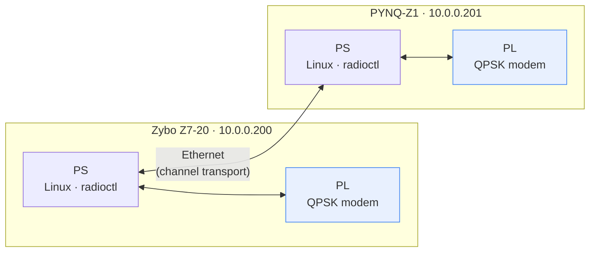
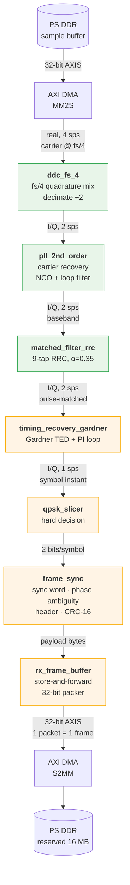
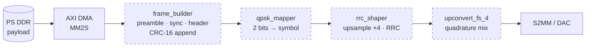
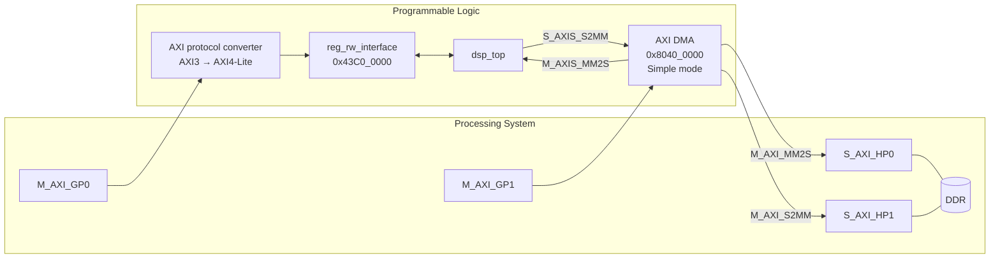
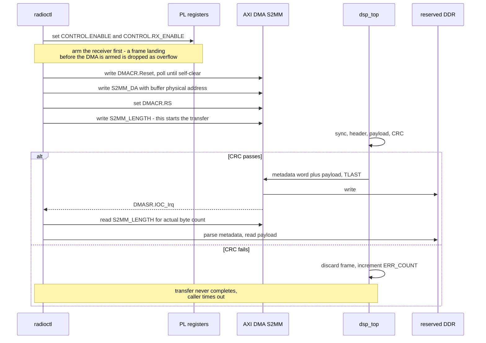

# Comms DSP — System Design

A QPSK radio implemented in FPGA fabric on two Zynq-7000 boards (Zybo Z7-20 and
PYNQ-Z1), with the modem in the PL and control, framing policy, and transport in
the PS. Both boards run the same bitstream; role is selected at runtime.

This document describes **architecture and interfaces**. For build procedure,
boot flow, and the running log of problems and fixes, see
[zybo_work.md](zybo_work.md).

**Status legend used throughout:** ✅ built · 🟡 built but unsimulated · ⬜ not started

---

## 1. System context



There is no RF front end. The "channel" is Ethernet between the two PS
instances: one board's PS pushes a sample stream into its PL via DMA, the PL
demodulates, and the recovered frame comes back through DMA. Impairments
(noise, frequency offset, timing offset) are injected deliberately so the
recovery loops have something to do.

That makes this a **DSP exercise wearing a radio's clothing** — which is the
point. The loops are real; only the propagation is simulated.

---

## 2. RX chain

### 2.1 Signal path



Green = simulated. Amber = built but unsimulated.

### 2.2 Stage reference

| Stage | File | In → Out | Status |
|---|---|---|---|
| Downconversion | `ddc_fs_4.vhd` | real 4 sps → I/Q 2 sps | ✅ |
| Carrier recovery | `pll_2nd_order.vhd` | I/Q 2 sps → I/Q 2 sps | ✅ |
| Matched filter | `matched_filter_rrc.vhd` | I/Q 2 sps → I/Q 2 sps | ✅ |
| Timing recovery | `timing_recovery_gardner.vhd` | I/Q 2 sps → I/Q 1 sps | 🟡 |
| Hard decision | `qpsk_slicer.vhd` | 1 symbol → 2 bits | 🟡 |
| Framing | `frame_sync.vhd` | bits → bytes + verdict | 🟡 |
| Buffering | `rx_frame_buffer.vhd` | bytes → 32-bit packet | 🟡 |

All sample-path signals are **16-bit signed**. The chain is **sample-rate
agnostic**: it advances one sample per `data_valid` strobe regardless of the
100 MHz system clock, so no clock-domain conversion is needed anywhere — only
the right strobe. `G_VALID_SRC` selects where that strobe comes from
(`VALID_DMA`, `VALID_ADC`, or `VALID_ALWAYS` for simulation).

### 2.3 Design decisions worth knowing

**Two independent recovery loops, both mandatory.** The carrier loop fixes
*what* the samples are; the timing loop fixes *when* they are taken. A perfect
carrier lock sampled at the wrong instant still yields no bits. They are
separate feedback systems and neither substitutes for the other.

**Coarse/fine split of carrier recovery.** `ddc_fs_4` removes the bulk carrier
using nothing but sign flips (`{+x,0,-x,0}` / `{0,+x,0,-x}`), leaving
`pll_2nd_order` to track a small residual offset — which is what a 2nd-order
loop is good at. Asking the PLL to acquire from DC all the way to fs/4 is the
fragile case, and an earlier version that did exactly that (DDC and PLL as
*alternative* branches rather than in series) fed the matched filter a signal
still at the carrier.

**2 sps is a Gardner requirement, not an arbitrary choice.** Gardner's timing
error detector needs exactly two samples per symbol, which is why `ddc_fs_4`
decimates by 2 rather than 4. It was chosen over Mueller & Müller because it is
**decision-free** — it needs no symbol decisions, so it can bootstrap before
anything is demodulated, avoiding the chicken-and-egg problem during
acquisition.

**Timing is currently quantised to whole input samples.** The loop takes
whichever sample its phase accumulator lands on, so the sampling instant moves
in half-symbol steps and residual error never drops below ±¼ symbol. This is a
bring-up compromise, not a final answer — but `mu` (the fractional symbol phase)
is exactly what a Farrow interpolator consumes, so the upgrade is additive: the
detector and loop filter don't change. Farrow + polyphase resampling is
deliberately deferred to a standalone project.

**Hard decision is free.** For Gray-mapped QPSK the nearest constellation point
is determined entirely by quadrant, so the hard decision *is* the two sign bits
— no comparators, no thresholds. The cost is about 2 dB versus soft decision,
which only pays off once there's an FEC decoder to consume the soft values.

**Phase ambiguity is resolved at the sync word.** A Costas/2nd-order carrier
loop locks to an arbitrary multiple of 90°, because a QPSK constellation is
symmetric under 90° rotation — nothing in a single symbol can resolve it.
`frame_sync` compares against all four rotations of the sync word
simultaneously; whichever matches names the rotation, and every subsequent
symbol is derotated by its inverse. The alternative, differential encoding,
resolves it without a sync word but roughly doubles the bit error rate, and a
sync word is in the frame anyway.

**Store-and-forward, not cut-through.** `rx_frame_buffer` holds the frame until
the CRC verdict arrives and releases it only if it passed. Streaming bytes to
DDR as they arrive would need no buffer — but the CRC arrives *after* the
payload, so userspace would find bytes in its buffer with no way to know if they
were good until a status register told it separately. Every reader would have to
implement that handshake correctly. Storing first means **a completed DMA
transfer is by construction a valid frame**. The cost is 256 bytes of RAM and a
frame ceiling the format already imposes.

**Downconversion sign is load-bearing.** `ddc_fs_4` multiplies by
`exp(-jωn) = cos - j·sin`, so the Q branch **negates** the sin term. Using
`+sin` yields the conjugate baseband — a *reflected* constellation — and a
reflection is not one of the four rotations `frame_sync` searches, so sync can
never fire. This hid well: a conjugated QPSK signal is still valid QPSK, the
constellation looks clean, the matched filter behaves, and the carrier loop
still locks. It only fails at the framer.

### 2.4 Verification model

`test_bench/rx_model.py` is a floating-point reference receiver that decodes
`ddc_input.dat` and checks it against `rx_expected.txt`.

It deliberately **does not model the PLL or the Gardner loop** — it applies the
known frequency and timing offsets directly. That separates two questions that
are miserable to debug together: *is the frame format self-consistent?* (this
model) versus *do the loops converge?* (RTL simulation). It also sweeps all four
carrier lock angles, because a clean run otherwise leaves the phase-ambiguity
path entirely untested.

Both bugs above were found by this model before any RTL simulation ran.

### 2.5 Known gaps

- Nothing downstream of the matched filter has been simulated in RTL (the
  floating-point model covers the framing, not the loops).
- **`pll_2nd_order` loop polarity needs re-confirming.** Correcting the DDC's Q
  sign also flips the apparent sign of any residual frequency offset, so a loop
  that converged against the old conjugated baseband may now diverge.
- **Gardner loop polarity is unverified.** The adjustment is added to the phase
  increment; whether that pulls the sampling instant toward or away from correct
  depends on sign convention. If `timing_err` grows instead of settling toward
  zero, negate `adj_v`. `G_K = 64` / `G_GAIN_FRAC = 24` are untuned.
- `pll_2nd_order` exports no `valid_out`; `dsp_top` compensates with a
  one-cycle delay that breaks silently if the PLL's pipelining changes.
- No lock detector, so `STATUS.PLL_LOCKED` reads 0 permanently.
- No AGC. `qpsk_slicer.mag_out` exists as a hook for one.
- False sync probability is ~2⁻³⁰ per symbol (32-bit word × 4 rotations). The
  CRC catches it, so it costs an `ERR_COUNT` increment, not corrupt data.
- Single frame buffer: a frame arriving while the previous is still draining is
  dropped and flagged in `STATUS.OVERFLOW`.

---

## 3. TX chain ⬜

**Not started.** No modulator, pulse shaper, or upconverter exists. `TX_LEN`,
`CONTROL.TX_START` and `STATUS.TX_BUSY` are wired through the register block and
work end to end, but drive nothing.

Reserved for it:



Two structural notes for when this gets built:

- The **RRC taps must come from the same definition as the RX filter**, at the
  transmit rate (4 sps, so 17 taps for a 4-symbol span). A matched filter is
  only "matched" if both ends derive from one pulse-shape definition — an
  earlier mismatch (69 TX taps against a 17-tap placeholder triangle) is exactly
  how this goes wrong. `waveform_generator.py::write_vhdl_coeffs(rx_sps=…)`
  already emits both rates from one source.
- **Role is runtime-selected, not build-time.** `MODE.ROLE` picks TX or RX from
  one bitstream, so both chains are always present in fabric and either board
  can be either end.

---

## 4. PL ↔ PS interface control

### 4.1 Physical interfaces



| Interface | Path | Address | Size |
|---|---|---|---|
| Control registers | GP0 → protocol converter | `0x43C0_0000` | 64 KB |
| DMA control | GP1 | `0x8040_0000` | 64 KB |
| DMA data (MM2S) | HP0 | DDR | — |
| DMA data (S2MM) | HP1 | DDR | — |
| Reserved DMA buffer | — | `0x3F00_0000` (Zybo) | 16 MB |

The GP ports are AXI3 and `reg_rw_interface` is an AXI4-Lite slave, hence the
protocol converter. It cannot be wired by `apply_bd_automation` — the axi4 rule
rejects a transparent bridge with "does not contain any address segments" — so
it is connected by hand in `create_project.tcl`.

**The reserved buffer address is board-specific.** Zybo Z7-20 has 1 GB, so the
top 16 MB starts at `0x3F00_0000`; PYNQ-Z1 has 512 MB, so its equivalent is
`0x1F00_0000`. The region is carved out by shrinking the devicetree `memory@0`
node, which guarantees the kernel never allocates from it and gives a fixed
physical address with no allocator involved — which is what a userspace-driven
DMA needs, since userspace hands the DMA a bus address directly.

### 4.2 Register map

Base `0x43C0_0000`, all 32-bit. Authoritative definitions are `C_REG_*` in
`hdl/pkg.vhd`.

| Offset | Name | Access | Description |
|---|---|---|---|
| `0x00` | `ID_VERSION` | RO | `0x5A790001` — confirms which bitstream is loaded |
| `0x04` | `CONTROL` | RW | Enable and command pulses |
| `0x08` | `MODE` | RW | Role and modulation selection |
| `0x0C` | `STATUS` | RO | Chain state, driven from PL |
| `0x10` | `TX_LEN` | RW | Transmit payload length, bytes |
| `0x14` | `RX_LEN` | RO | Payload length of last good frame |
| `0x18` | `FRAME_COUNT` | RO | Frames passing CRC since reset |
| `0x1C` | `ERR_COUNT` | RO | Frames failing CRC since reset |

**`CONTROL` (0x04)**

| Bit | Name | Notes |
|---|---|---|
| 0 | `ENABLE` | Master enable |
| 1 | `TX_START` | Write-1 pulse, **self-clearing in PL** |
| 2 | `RX_ENABLE` | Enables `frame_sync`; low holds it in reset |
| 3 | `CLR_STATS` | Write-1 pulse, **self-clearing in PL** |

**`MODE` (0x08)**

| Bits | Name | Notes |
|---|---|---|
| 0 | `ROLE` | 0 = RX, 1 = TX |
| 3:1 | `MOD` | Modulation select — reserved, unused |
| 7:4 | `SPREAD` | DSSS spreading factor — reserved, unused |

**`STATUS` (0x0C)**

| Bit | Name | Source | Status |
|---|---|---|---|
| 0 | `TX_BUSY` | — | ⬜ tied 0, no TX chain |
| 1 | `PLL_LOCKED` | — | ⬜ tied 0, no lock detector |
| 2 | `FRAME_VALID` | `frame_sync.in_frame` | ✅ high once synced |
| 3 | `OVERFLOW` | `rx_frame_buffer` | ✅ frame dropped, buffer busy |

Read-only offsets are driven from `status_reg` in `system_top.vhd`. `ID_VERSION`
is answered by `reg_rw_interface` directly from `C_ID_MAGIC` and is deliberately
*not* also driven through `status_reg` — two sources for one register invites
drift.

### 4.3 Over-the-air frame format (v1)

```
┌──────────────┬──────────────┬────────────┬─────────────────┬────────────┐
│  PREAMBLE    │  SYNC WORD   │   HEADER   │     PAYLOAD     │   CRC-16   │
│  ≥32 bits    │   32 bits    │  16 bits   │   0–255 bytes   │  16 bits   │
│  0xCCCCCCCC  │  0x1ACFFC1D  │            │                 │            │
└──────────────┴──────────────┴────────────┴─────────────────┴────────────┘
                                    │
                  ┌─────────────────┴─────────────────┐
                  │  TYPE 4  │     LEN 8    │  SEQ 4  │
                  └──────────┴──────────────┴─────────┘
```

- **PREAMBLE** is not searched for — it exists purely to give the carrier and
  timing loops runway. Length is a transmit-side choice; the generator defaults
  to 256 bits (128 symbols) rather than the nominal 32, because expecting two
  feedback loops to settle inside 16 symbols is optimistic.
- **The preamble is `0xCCCC…`, not `0xAAAA…`**, and the difference matters more
  than it looks. Under this QPSK mapping `1010…` maps every symbol pair to the
  *same constellation point*, and Gardner's error term
  `(I[k] − I[k−1])·I[k−1/2]` is then identically zero — the timing loop gets no
  error signal at all and cannot acquire. `1100…` alternates between two
  antipodal points, giving a transition every symbol. Alternating bits are the
  right instinct at the *bit* level; this constellation cares about the *symbol*
  level.
- **SYNC WORD** is the CCSDS attached sync marker. It provides frame alignment
  *and* resolves carrier phase ambiguity.
- **CRC-16-CCITT**, poly `0x1021`, init `0xFFFF`, no final XOR, covering
  **HEADER + PAYLOAD**.
- Frame types: `0x0` CMD, `0x1` DATA, `0x2` ACK.

### 4.4 DMA packet format (PL → PS)

One AXI-Stream packet per frame, terminated by `TLAST`. The packet is prefixed
with a **metadata word** so the buffer is self-describing and userspace needs no
side channel:

| Bits | Field |
|---|---|
| 7:0 | Payload length, bytes |
| 11:8 | Frame type |
| 15:12 | Sequence number |
| 31:16 | Frame counter, low 16 bits (gap detection) |

Payload bytes are packed **little-endian within each word** — byte 0 in bits
7:0 — so a `memcpy` on ARM returns wire order. `TKEEP` marks the valid bytes of a
partial final word.

---

## 5. Software

### 5.1 Kernel-side model

Every PL interface is reached through **UIO**, with no custom kernel driver and
no out-of-tree module.

| Devicetree node | Compatible | Purpose |
|---|---|---|
| `uio@43c00000` | `generic-uio` | Control registers |
| `uio@80400000` | `generic-uio` | AXI DMA control |
| `uio@3f000000` | `generic-uio` | Reserved DMA buffer |

Binding requires **`uio_pdrv_genirq.of_id=generic-uio` in the kernel command
line** — `uio_pdrv_genirq` ships with an empty OF match table that this
parameter fills in. Without it there are no `/dev/uio*` nodes at all.

**The DMA is deliberately not bound to `xlnx,axi-dma-1.00.a`.** That driver is a
dmaengine provider, and dmaengine has no userspace API — reaching it from an
application means an out-of-tree shim like `dma_proxy`. Since the whole datapath
is one application driving one DMA, UIO removes the kernel from the loop
entirely.

**Two consequences of the UIO buffer mapping, both load-bearing:**

1. `uio_pdrv_genirq` maps `UIO_MEM_PHYS` with `pgprot_noncached`. The Zynq HP
   ports are **not cache-coherent with the CPU**, so through a normal cached
   mapping the CPU would serve stale lines for data the PL had just written.
2. The physical address is readable from
   `/sys/class/uio/uioN/maps/map0/addr`, so nothing hardcodes the board-specific
   buffer address.

**UIO numbering is not stable.** With three UIO devices the `/dev/uioN` index
depends on probe order. Userspace must discover devices by matching the sysfs
physical address, not by assuming `/dev/uio0`.

### 5.2 `radioctl`

Buildroot package at `zybo-br-tree/package/radioctl/`, installed into the
rootfs.

```
radioctl <command>

  dump                  every register, decoded
  read  <reg>           read one register
  write <reg> <value>   write one register (hex or decimal)

  role  tx|rx           select transmit or receive
  enable | disable      set/clear CONTROL.ENABLE
  listen                enable the receive path
  transmit [len]        pulse TX_START, optionally setting TX_LEN first
  clrstats              pulse CLR_STATS

  dmainfo               DMA buffer location and status (maps the DMA)
  rx [timeout_ms]       arm the DMA, wait for one frame, print it
  rxloop [timeout_ms]   same, repeating until interrupted
```

`dump` and `read` touch only the register window. `dmainfo`, `rx` and `rxloop`
additionally map the DMA control window — stay on the first two whenever the
PL's state is uncertain, since an unclocked or unprogrammed PL hard-locks the
CPU on any access it cannot answer.

#### Registers and access

| Name | Offset | Access | Meaning |
|---|---|---|---|
| `id` | `0x00` | R | `0x5A790001` = expected bitstream; anything else means wrong or unloaded PL |
| `control` | `0x04` | R/W | Enable and command pulses |
| `mode` | `0x08` | R/W | Role and modulation select |
| `status` | `0x0C` | R | Chain state, driven from PL |
| `tx_len` | `0x10` | R/W | Transmit payload length, 0–255 bytes |
| `rx_len` | `0x14` | R | Payload length of the last good frame |
| `frames` | `0x18` | R | Frames passing CRC since reset |
| `errors` | `0x1C` | R | Frames failing CRC since reset |
| `syncs` | `0x20` | R | Sync-word detections, whether or not CRC later passed |
| `qmin` | `0x24` | R | Accumulator, sum of min(abs I, abs Q) |
| `qmax` | `0x28` | R | Accumulator, sum of max(abs I, abs Q) |
| `qsyms` | `0x2C` | R | Symbols covered by the two accumulators |
| `build` | `0x30` | R | First 32 bits of the git commit the bitstream was built from |

#### Values you can write

**`control` (0x04)** — bits 1 and 3 are write-one pulses that self-clear in the
PL, so reading them back as 0 is correct behaviour, not a failed write.

| Bit | Value | Effect |
|---|---|---|
| 0 | `0x1` | `ENABLE` — master enable, level |
| 1 | `0x2` | `TX_START` — pulse, self-clearing |
| 2 | `0x4` | `RX_ENABLE` — enables `frame_sync`; low holds it in reset |
| 3 | `0x8` | `CLR_STATS` — pulse; zeroes counters and quality accumulators |

```bash
radioctl write control 0x5     # ENABLE + RX_ENABLE   (same as: radioctl listen)
radioctl write control 0x9     # ENABLE + CLR_STATS   (same as: radioctl clrstats)
```

**`mode` (0x08)**

| Bits | Value | Effect |
|---|---|---|
| 0 | `0x0` / `0x1` | `ROLE`: 0 = RX, 1 = TX |
| 3:1 | — | `MOD`, modulation select — reserved, unused |
| 7:4 | — | `SPREAD`, DSSS factor — reserved, unused |

**`tx_len` (0x10)** — payload bytes, 0–255. Larger values exceed the frame
format's 8-bit length field.

#### What read values mean

| Read | Value | Means |
|---|---|---|
| `id` | `0x5A790001` | Correct bitstream loaded |
| `id` | hangs the board | PL unclocked or unprogrammed — see `clk_ignore_unused` in `zybo_work.md` |
| `id` | anything else | Wrong bitstream |
| `build` | matches `git rev-parse --short=8 HEAD` | PL was built from this tree |
| `build` | `0xffffffff` | Built with git unavailable |
| `build` with `BUILD_DIRTY` set | — | Hash is a lower bound; tree had uncommitted changes |
| `frames`, `errors` | both 0 | No sync at all — check `syncs` next |
| `syncs` > 0 but `frames` = 0 | — | Sync fires, CRC fails: symbol errors inside the frame body |
| `qmin`/`qmax` | approaching 1.0 | Clean constellation, sitting on the diagonal |
| `qmin`/`qmax` | below 0.7 | Poor lock — phase error, ISI or noise |
| `rx_len` | 0–255 | Payload bytes in the last good frame |

**`status` (0x0C) bits**

| Bit | Name | Set means |
|---|---|---|
| 0 | `TX_BUSY` | Transmit in progress — *tied 0, no TX chain yet* |
| 1 | `PLL_LOCKED` | Carrier locked — *tied 0, no lock detector yet* |
| 2 | `FRAME_VALID` | `frame_sync` is past its hunt state |
| 3 | `OVERFLOW` | A frame was dropped because the buffer was still draining |
| 4 | `BUILD_DIRTY` | Bitstream built from a tree with uncommitted changes |

`clrstats` resets `frames`, `errors`, `syncs` and the quality accumulators.
`id` and `build` are constants in fabric and are unaffected.

### 5.3 RX receive sequence



The ordering matters in two places. **Arm the receiver before the DMA**, or a
frame arriving between the two is dropped and flagged as an overflow rather than
captured. And in Simple mode **writing `S2MM_LENGTH` is what starts the
transfer**, so the destination address and `RS` must both be set first.

`S2MM_LENGTH` reads back the **actual** byte count after completion, because the
PL terminates the transfer early with `TLAST` at the end of a frame rather than
filling the requested capacity.

### 5.4 AXI DMA registers used

Simple mode only — SG is disabled in the IP, so descriptor registers do not
exist. Byte offsets from `0x8040_0000`.

| Offset | Register | Notes |
|---|---|---|
| `0x30` | `S2MM_DMACR` | bit 0 `RS`, bit 2 `Reset`, bit 12 `IOC_IrqEn` |
| `0x34` | `S2MM_DMASR` | bit 1 `Idle`, bits 4–6 errors, bit 12 `IOC_Irq` (w1c) |
| `0x48` | `S2MM_DA` | Destination physical address |
| `0x58` | `S2MM_LENGTH` | Write starts transfer; read returns bytes moved |

Simple mode caps one transfer at 2²⁶−1 bytes — far more than a frame, or than
any stimulus buffer pushed the other way.

### 5.5 Software gaps

- **Polling, not interrupts.** `radioctl` polls `DMASR.IOC_Irq` with a 1 ms
  sleep. The devicetree already routes the S2MM interrupt to the DMA's UIO node,
  so a blocking `read()` on `/dev/uioN` is available and is the natural next
  step; it needs the standard re-enable write after each interrupt.
- No transport layer. Nothing yet carries frames between the two boards over
  Ethernet.
- No TX-side software, because there is no TX chain.
- `radioctl` is a bring-up tool, not a library. A daemon holding the mappings
  open and exposing a socket would suit continuous operation better than a
  process that re-arms the DMA per invocation.

---

## 6. File map

| Path | Contents |
|---|---|
| `dsp-cake/comms_dsp/hdl/` | All PL sources; `system_top.vhd` is the design top |
| `dsp-cake/comms_dsp/hdl/pkg.vhd` | Register map, frame format, QPSK rotation, CRC |
| `dsp-cake/comms_dsp/hdl/dsp_pkg.vhd` | RRC taps, DSP-local types |
| `dsp-cake/comms_dsp/test_bench/` | Testbenches and stimulus |
| ⤷ `waveform_generator.py` | TX model: framed bursts, impairments, RRC taps |
| ⤷ `rx_model.py` | Floating-point reference receiver, format self-check |
| ⤷ `rx_expected.txt` | Per-frame expected output, incl. DMA metadata word |
| `vivado/create_project.tcl` | Full project + block design, scripted |
| `zybo-br-tree/configs/` | `zybo_z720_defconfig`, `pynq_z1_defconfig` |
| `zybo-br-tree/board/common/` | Zybo devicetree, boot script, kernel fragment |
| `zybo-br-tree/board/pynq-z1/` | PYNQ devicetree, U-Boot patches |
| `zybo-br-tree/package/radioctl/` | Userspace control tool |

**RRC taps are generated, not hand-written.** `waveform_generator.py` emits both
the stimulus and `rrc_coeffs` from one pulse-shape definition, at the correct
samples-per-symbol for each end. Editing the taps by hand breaks the matched
filter's only guarantee.
